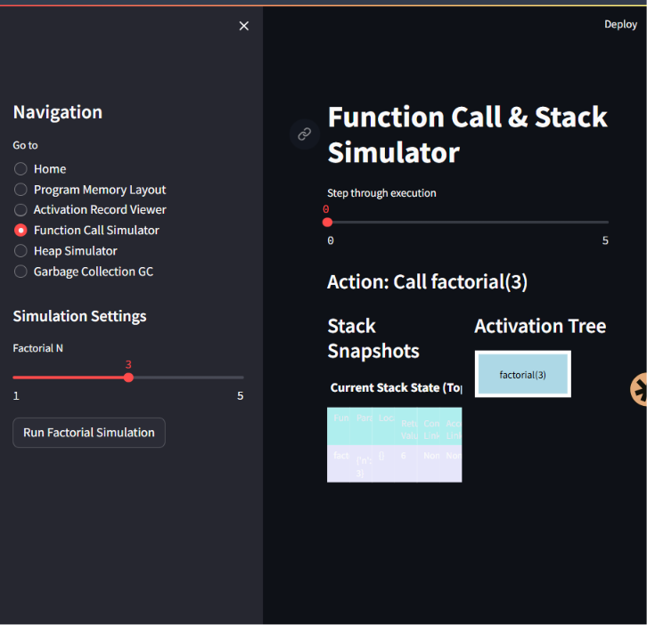

# Runtime Environment Simulator

A comprehensive, end-to-end interactive simulation of Compiler Runtime Environments, Function Calls, Activation Records, Stack Memory, Heap Management, and Garbage Collection. Developed as a Compiler Design Laboratory Case Study.

## Project Overview

This project provides an interactive GUI built with Streamlit and Python that visualizes how memory is managed during program execution. It covers theoretical and practical implementations of:
- Memory Segmentation (Code, Global, Stack, Heap)
- Activation Records (Return Address, Links, Parameters, Locals)
- Function Calls (Simple, Nested, Recursive like Factorial and Fibonacci)
- Activation Trees and Stack Snapshots
- Access to Nonlocal Data (Static Links & Display Tables)
- Heap Allocation and Reference Tracking
- Reachability Analysis
- Garbage Collection (Mark-Sweep and Reference Counting)

## Features

- **Interactive Function Simulation:** Trace recursive and nested function calls.
- **Dynamic Activation Trees:** See visually how the call stack branches out.
- **Stack Memory Snapshots:** Watch push/pop operations with full activation records.
- **Heap Visualizer:** Connect objects visually using `networkx` and `graphviz`.
- **Garbage Collection Animation:** Step through Mark-Sweep phases and Reference Counting increments/decrements.
- **Academic Reporting:** Generates full viva questions, tests, and a laboratory report.

## Folder Structure

```
Runtime_Environment_Simulator/
│
├── README.md                # Project overview and setup instructions
├── requirements.txt         # Python dependencies
├── main.py                  # Entry point for the Streamlit GUI
├── config.py                # Configuration and global constants
│
├── runtime/                 # Core logic for memory and function simulation
│   ├── activation_record.py
│   ├── stack_manager.py
│   ├── activation_tree.py
│   ├── nonlocal_access.py
│   ├── heap_manager.py
│   ├── gc_mark_sweep.py
│   ├── gc_reference_count.py
│   └── memory_layout.py
│
├── visualization/           # Graphing and plotting logic (NetworkX, Plotly)
│   ├── tree_visualizer.py
│   ├── stack_visualizer.py
│   ├── heap_visualizer.py
│   └── memory_visualizer.py
│
├── gui/                     # Streamlit frontend pages
│   ├── home.py
│   ├── activation_record_page.py
│   ├── stack_page.py
│   ├── heap_page.py
│   ├── gc_page.py
│   └── dashboard.py
│
├── docs/                    # Academic and theoretical documentation
│   ├── theory.md
│   ├── report.md
│   └── viva_questions.md
│
└── tests/                   # Sample inputs and test cases
    └── test_cases.md
```

## Installation & Environment Setup

### Prerequisites
- **Python 3.8+** installed on your system.
- **Graphviz** installed on your system (Required for generating network graphs).
  - *Windows:* Download from https://graphviz.gitlab.io/_pages/Download/Download_windows.html and add the `bin` folder to your system PATH.
  - *Linux:* `sudo apt-get install graphviz`
  - *Mac:* `brew install graphviz`

### Step 1: Clone or Navigate to Project
```bash
cd "C:\Desktop\case study\cd case study 3\Runtime_Environment_Simulator"
```

### Step 2: Create a Virtual Environment
```bash
python -m venv venv
```

### Step 3: Activate Virtual Environment
- **Windows:**
  ```bash
  venv\Scripts\activate
  ```
- **Linux/Mac:**
  ```bash
  source venv/bin/activate
  ```

### Step 4: Install Dependencies
```bash
pip install -r requirements.txt
```

### Step 5: Run the Application
```bash
streamlit run main.py
```

### Step 6: Open the GUI
The terminal will provide a `Local URL` (typically `http://localhost:8501`). Open this in your web browser to interact with the Simulator.

## Sample Inputs and Expected Outputs

**Input (Simulation of Factorial 3):**
- Function call to `factorial(3)`

**Expected Output:**
- An activation tree showing `fac(3) -> fac(2) -> fac(1) -> fac(0)`
- Stack snapshots showing up to 4 Activation Records piled on top of each other.
- The return phase where the stack pops down to empty.

**Input (Mark-Sweep GC):**
- Create objects A, B, C.
- Link A -> B. (C is unreachable).

**Expected Output:**
- Reachability Graph showing A and B in green (Reachable) and C in red (Unreachable).
- Mark Phase: A and B get a "Mark=1" flag.
- Sweep Phase: C is removed from the heap memory display, reclaiming its space.

## Troubleshooting

- **Graphviz ExecutableNotFound:** Ensure Graphviz is installed on your OS and the `bin` directory is in your System Environment Variables `PATH`. Restart your terminal or IDE afterward.
- **Port already in use:** If port 8501 is occupied, Streamlit will try the next available port. Check the terminal output for the exact URL.

## Future Enhancements
- Visualizing multithreaded runtime environments with thread-local stacks.
- Simulating Copying Collection (Cheney's Algorithm) with From-Space and To-Space visualizations.
- Supporting Object-Oriented memory layouts (v-tables and dynamic dispatch records).
